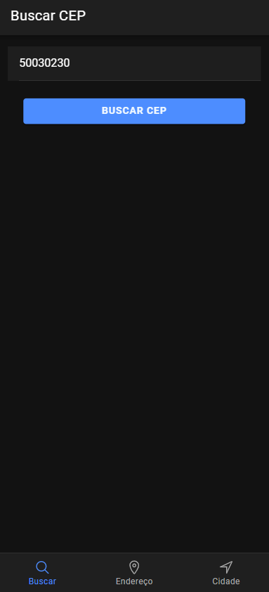
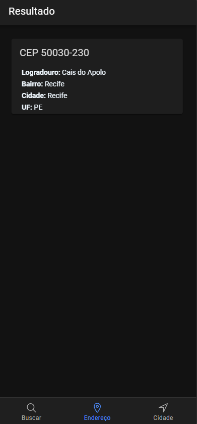
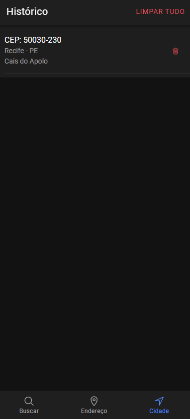
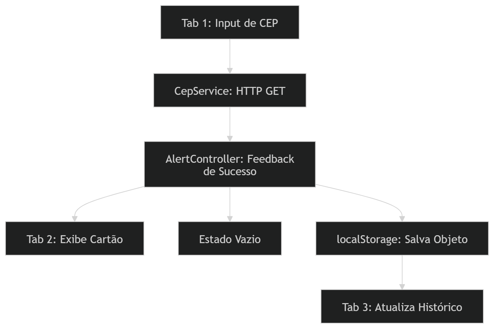

# 📍 Busca CEP Mobile

> Aplicativo mobile para consulta de endereços via CEP, construído com Ionic + Angular e integrado à API ViaCEP.


---

## 📖 Sobre o projeto

[cite_start]Aplicativo mobile desenvolvido com **Ionic Framework** e **Angular**, utilizando arquitetura orientada a serviços (NgModules)[cite: 27, 64]. O usuário digita um CEP, o app consulta a API ViaCEP em tempo real, exibe o endereço completo e gerencia de forma dinâmica um histórico persistente das buscas realizadas.

---

## 📱 Telas (Tabs)

| Tab | Tela | Descrição |
|-----|------|-----------|
| **Tab 1** | Buscar CEP | Campo de entrada com validações para digitação do CEP e disparo da consulta HTTP. |
| **Tab 2** | Exibir Endereço | Apresenta os dados detalhados da busca (logradouro, bairro, cidade, UF). Exibe tela de "Estado Vazio" caso nenhuma pesquisa tenha sido feita. |
| **Tab 3** | Histórico | Lista cronológica dos CEPs consultados com armazenamento persistente e atalhos para exclusão individual ou total. |




---

## 🚀 Implementações da Segunda Parte

A evolução do projeto contemplou recursos avançados de experiência de usuário (UX) e segurança de dados local:

### 1. Persistência de Dados com `localStorage`
- [cite_start]Integração com o ecossistema de armazenamento do navegador e da WebView móvel[cite: 69, 173].
- [cite_start]Utilização de `JSON.stringify()` para serialização de arrays de objetos e `JSON.parse()` para recuperação segura durante a inicialização do app (`ngOnInit`)[cite: 84, 85, 104, 124, 173].
- [cite_start]Os dados não são perdidos caso a aplicação seja atualizada ou fechada[cite: 30, 171, 173].

### 2. Tratamento de Estados Vazios e Condicionais (`*ngIf`)
- **Proteção de Interface:** Correção do erro de propriedades indefinidas (`TypeError: Cannot read properties of undefined`) utilizando diretivas estruturais `*ngIf; else` no carregamento dos atributos assíncronos.
- **Feedback Visual:** Criação de templates amigáveis com `<ng-template>` exibindo ícones e mensagens instrutivas (ex: *"Nenhum endereço pesquisado ainda"*) quando variáveis locais ou arrays do histórico encontram-se vazios.

### 3. Alertas Clássicos de Confirmação (`AlertController`)
- Implementação de popups nativos de interface gráfica do Ionic para notificar o usuário instantaneamente quando um endereço é localizado com sucesso, melhorando a responsividade visual do aplicativo.

### 4. Resolução de Desafios Acadêmicos 🏆
[cite_start]Seguindo as diretrizes práticas propostas pelo Prof. João Ferreira[cite: 3]:
- [cite_start]**Persistência de Objetos Completos:** Adaptação da estrutura para salvar o mapeamento de dicionários inteiros contendo logradouro, bairro e localidade, em vez de strings simples[cite: 176].
- [cite_start]**Botão Limpar Tudo:** Inclusão de um método global `localStorage.clear()` acionado por um botão de controle na barra superior da listagem de histórico para expurgar todos os dados de uma vez só[cite: 25, 80, 178].

---

## 🛠️ Tecnologias

- **Ionic Framework 7** — Componentes de UI nativos e controladores de feedback (Alerts)
- [cite_start]**Angular 17** — Framework SPA utilizando arquitetura baseada em `NgModules` [cite: 27]
- **TypeScript 5** — Tipagem estática estruturada
- **ViaCEP API** — API pública para consulta de endereços
- [cite_start]**Web Storage API** — Mecanismo síncrono para retenção de dados via `localStorage` [cite: 69, 175]

---

## 🔄 Fluxo de Dados Atualizado



---

## ⚙️ Como executar

### Pré-requisitos
- Node.js (versão LTS recomendada)
- npm
- Ionic CLI instalado globalmente (`npm install -g @ionic/cli`)

### Inicialização do Ambiente

```bash
# Clone o repositório ou acesse a pasta do projeto
cd cepApp

# Instale todas as dependências declaradas no package.json
npm install

# Caso haja conflito de versões de pacotes legados, utilize:
npm install --legacy-peer-deps

# Inicie o servidor de desenvolvimento local
ionic serve
```

---

## 🧑‍💻 Aluna: Isis Marieli da Silva Moura

- **Matrícula:** 01482889

**Projeto Acadêmico**
